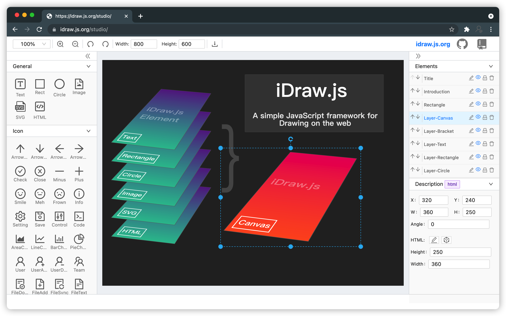

<h1 align="center">iDraw.js</h1>

<p align="center">iDraw.js is a simple JavaScript framework for Drawing on the web.</p>

<p align="center">一个面向Web绘图的JavaScript框架</p>


<p align="center"><a href="https://idraw.js.org">idraw.js.org</a></p>


<p align="center">

  <a title="CI" href="https://github.com/idrawjs/idraw/actions/workflows/node.js.yml">
    
  <a>

  <a href="https://codecov.io/gh/idrawjs/idraw">
    
  </a>
    
  <a href="https://www.npmjs.com/package/idraw">
    
  </a>
  <a href="https://www.npmjs.com/package/idraw">
    
  </a>
</p>


<!-- [](https://github.com/idrawjs/idraw/actions/workflows/node.js.yml) -->

<hr/>


- [Documents](https://idraw.js.org/docs/en/) | [中文文档](https://idraw.js.org/docs/zh/) 
- [Online Playground](https://idraw.js.org/playground/) | [在线API示例](https://idraw.js.org/playground/)
- [Online Studio](https://idraw.js.org/studio/) | [在线绘图演示](https://idraw.js.org/studio/)
 
## @idraw/studio Preview

The preview of `@idraw/studo`. Click [here](https://github.com/idrawjs/studio) to get it.

<div style="text-align: center">
  
</div>

## Install

```
npm i idraw
```

## Getting Started

### Common

```js
import iDraw from 'idraw';

const idraw = new iDraw(
  document.querySelector('#app'),
  {
    width: 600,
    height: 400,
    contextWidth: 600,
    contextHeight: 400,
    devicePixelRatio: 1,
  }
);
idraw.addElement({
  name: "rect-1",
  x: 140,
  y: 120,
  w: 200,
  h: 100,
  type: "rect",
  desc: {
    bgColor: "#f7d3c1",
    borderRadius: 20,
    borderWidth: 4,
    borderColor: "#ff6032",
  },
});
```

### React

```jsx
import iDraw from 'idraw';
import { useEffect, useRef } from 'react';

function Demo() {
  const ref = useRef(null);
  useEffect(() => {
    const idraw = new iDraw(ref.current, {
      width: 600,
      height: 400,
      contextWidth: 600,
      contextHeight: 400,
      devicePixelRatio: 1,
    });
    idraw.addElement({
      name: "rect-001",
      x: 140,
      y: 120,
      w: 200,
      h: 100,
      type: "rect",
      desc: {
        bgColor: "#f7d3c1",
        borderRadius: 20,
        borderWidth: 4,
        borderColor: "#ff6032",
      },
    })
  }, []);

  return (
    <div ref={ref}></div>
  )
}
```

### Vue

```html
<template>
  <div ref="mount"></div>
</template>

<script setup >
import iDraw from 'idraw';
import { ref, onMounted } from 'vue'
const mount = ref();

onMounted(() => {
  const idraw = new iDraw(mount.value, {
    width: 600,
    height: 400,
    contextWidth: 600,
    contextHeight: 400,
    devicePixelRatio: 1,
  });
  idraw.addElement({
    name: "rect-001",
    x: 140,
    y: 120,
    w: 200,
    h: 100,
    type: "rect",
    desc: {
      bgColor: "#f7d3c1",
      borderRadius: 20,
      borderWidth: 4,
      borderColor: "#ff6032",
    },
  })
})
</script>
```


## Contributing

We appreciate your help!

To contribute, please follow the steps:

- `git clone git@github.com:idrawjs/idraw.git`
- `cd idraw`
- `npm i`
- `npm run init`
- `npm run dev`  for compiling all packages
  -  `npm run dev ${module}` for compiling single module such as `idraw`
- `npm run serve` for starting a server 
- http://127.0.0.1:8080
  - http://127.0.0.1:8080/packages/idraw/examples/features/
  - http://127.0.0.1:8080/packages/core/examples/features/